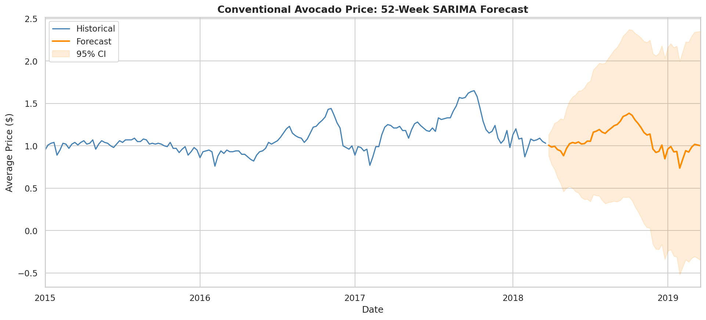
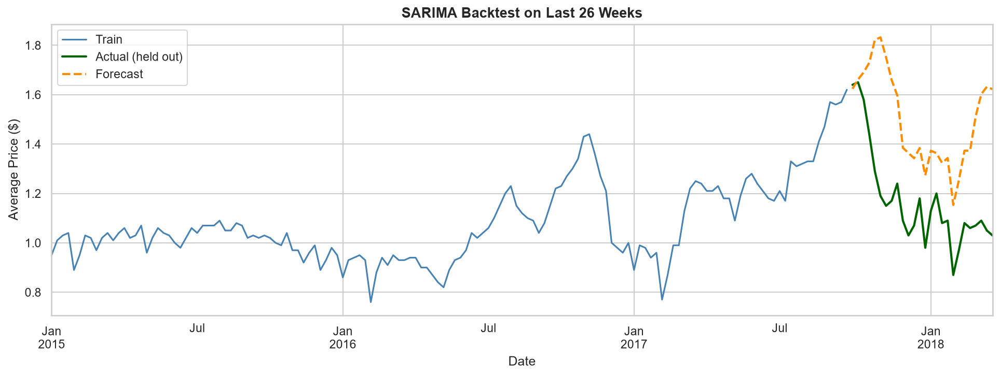

# Avocado Sales Data Pipeline

A multi-source data pipeline for U.S. avocado sales data, ending with a SARIMA time-series forecast for the next year of national prices.

The notebook is committed with all cells executed, so the charts and results render inline on GitHub.

## Preview

The 52-week forecast with its confidence band, and the honest backtest that earns it: holding out the last 26 weeks gives a MAPE of about 32%, which says the seasonal signal is real but weekly prices are noisy and a single SARIMA only takes you so far.

| 52-week forecast | Backtest (last 26 weeks held out) |
|------------------|-----------------------------------|
|  |  |

## What's in here

- **`avocado_pipeline.ipynb`** - the full pipeline (ingest, validate, clean, EDA, forecast)
- **`figures/`** - rendered charts saved during the run
- **`output/`** - cleaned weekly series, forecast CSV, and top-region rollup
- **`data/`** - source files (see Data section)

## Highlights

- **Four-source ingestion**: CSV, line-delimited JSON, Excel sheet, and SQLite. Each format requires its own parser and date-handling, and the SQLite copy is used to validate the merged result of the other three.
- Cleaned national weekly time series for organic and conventional pricing
- EDA covering price by type, top regions, monthly seasonality, and the volume-vs-price relationship
- **SARIMA forecasting** of conventional avocado prices over a 52-week horizon with 95% confidence intervals
- **Backtest evaluation** holding out the last 26 weeks of data, with MAE, RMSE, and MAPE reported

## Tools

Python 3.11, pandas, NumPy, matplotlib, seaborn, SQLite (sqlite3), statsmodels, openpyxl.

## Data

The `data/` folder needs four files:

- `avocado.csv` - main historical dataset (Hass Avocado Board / Kaggle, ~2 MB). Source: https://www.kaggle.com/datasets/neuromusic/avocado-prices
- `avocado_secondary_NY.json` - NY rows (line-delimited JSON, included)
- `avocado_secondary_SF.xlsx` - SF rows (Excel, included)
- `avocado_secondary_ALL.db` - SQLite validation copy (included)

The main CSV is around 2 MB so it ships with the repo. The secondary files are tiny.

## Running it

```bash
pip install -r requirements.txt
jupyter notebook avocado_pipeline.ipynb
```

Run cells top to bottom. Figures save to `figures/`, derived datasets save to `output/`.

## Next steps

If I extended this I would benchmark Prophet and a small LightGBM model with engineered seasonal features against SARIMA, add exogenous variables (volume, lagged prices), and build region-level forecasts instead of national-only.
